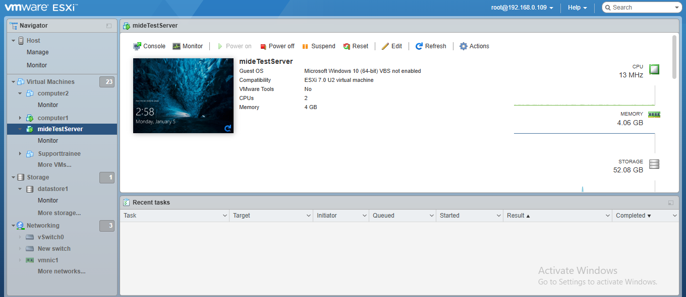
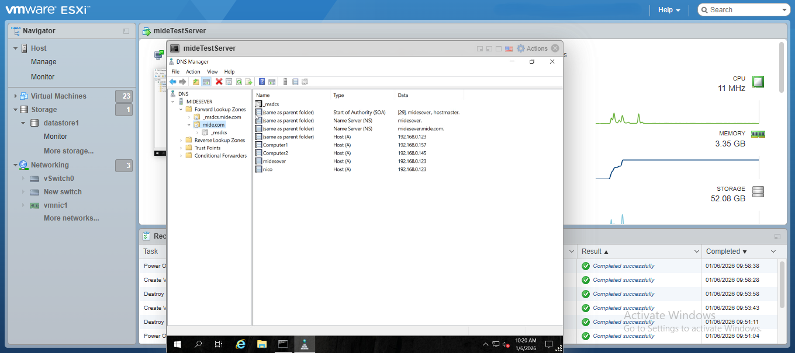
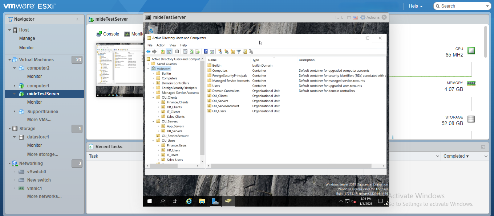

# 🏢 Enterprise IT Infrastructure Lab
**By Taiwo Olumide**

## 📌 Overview
This project documents my hands-on experience building a virtualized enterprise network. It covers the full lifecycle of a Windows Server environment, from initial provisioning on **VMware ESXi** to advanced **Active Directory** troubleshooting.

---

## 🏗️ Phase 1: Bare-Metal Virtualization (VMware ESXi)
**Goal:** Deploying a high-performance lab environment using a Type-1 Hypervisor.

* **Hypervisor:** VMware ESXi 7.0 Update 2.
* **Implementation:** Provisioned virtual machines (including `mideTestServer`) to serve as domain nodes.
* **Hardware Specs:** Allocated 2 vCPUs and 4GB RAM per core instance to balance host performance and guest stability.
* **Storage:** Utilized a local datastore (`datastore1`) with 52GB allocation for system drives.
* **Technical Decision:** Implemented **Thin Provisioning** to optimize physical storage usage.

---

## 🌐 Phase 2: DNS & Network Connectivity
**Goal:** Establishing a reliable naming service for domain-wide communication.

* **Implementation:** Configured Active Directory-Integrated DNS with Forward and Reverse Lookup Zones.
* **Network Baseline:** Assigned static IP addressing to prevent service disruption and ensured DNS pointing to the local loopback (`127.0.0.1`) for the DC.
* **Troubleshooting (The Firewall Blocker):** Resolved a "Request Timed Out" issue during `nslookup` tests by creating custom **Inbound Rules** in Windows Firewall for Port 53 (DNS) and ICMP.
* **Resolution:** Verified SRV record registration using `dnscmd`, ensuring clients can locate the Domain Controller services.

## 🛡️ Phase 3: Active Directory & Group Policy (GPO)
**Goal:** Centralized identity and security governance.
* **Implementation:** Promoted a Domain Controller (DC) and designed a structured **OU hierarchy**.
* **Governance:** Created dedicated OUs for Users, Computers, and Admin accounts to apply granular policies.
* **Security Hardening (GPO):** Implemented a Password Lockout Policy and used `gpresult /r` to verify application.

---

## 🔧 Phase 4: Advanced Troubleshooting (The "Trust" Fix)
**Goal:** Recovering from critical domain failures.
* **The Problem:** Workstation `testMideComputer` failed to authenticate with a "Trust Relationship" error.
* **The Root Cause:** Identified a password de-sync between the local machine and Active Directory (Secure Channel failure).
* **The Fix:** Performed a **Secure Channel Reset** by disjoining and re-joining the machine to the domain.

---

## 🐧 Phase 5: Hybrid Environment (Ubuntu Linux)
**Goal:** Managing cross-platform OS persistence.
* **The Issue:** Ubuntu VM reverted to an "uninstalled" state after shutdown.
* **The Fix:** Identified the installer ISO was still mapped. Unmapped the virtual drive to ensure the system booted from the virtual disk.

---

## 🛠️ Commands Reference
| Tool | Command |
| :--- | :--- |
| **DNS** | `nslookup [hostname]` |
| **GPO Audit** | `gpresult /r` |
| **AD Trust** | `Test-ComputerSecureChannel -Verify -Repair` |
