# 🏢 Enterprise IT Infrastructure Lab

**Author:** Taiwo Olumide  
**Domain:** `nico.local`  
**Hypervisor:** VMware ESXi 7.0  
**Network:** `192.168.0.0/24`

---

## 📌 Project Overview

This lab simulates a real enterprise IT environment built from scratch using VMware ESXi.

The environment includes:

- Windows Server 2019 Domain Controllers  
- Active Directory Domain Services (AD DS)  
- Active Directory–Integrated DNS  
- Group Policy  
- Windows 10 domain-joined clients  
- Real troubleshooting scenarios  

The objective was to design, deploy, break, fix, and validate a working enterprise infrastructure.

---

## 🗺️ Network Architecture

### Topology Diagram

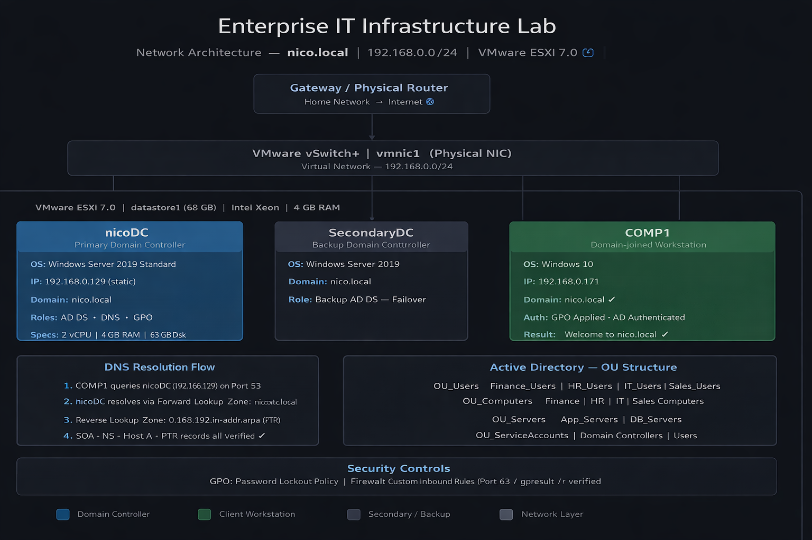

**Flow:**  
Physical Router → vmnic1 → vSwitch0 → ESXi Host → Virtual Machines

---

### Machines

| Machine | Role | IP Address |
|----------|------|------------|
| nicoDC | Primary Domain Controller | 192.168.0.129 (Static) |
| SecondaryDC | Secondary Domain Controller | Internal |
| COMP1 | Windows 10 Client | 192.168.0.171 |
| LDAP2ConnectionAgent | LDAP Test Machine | 192.168.0.110 |
| Other Lab VMs | Testing | Internal |

---

## 🛠️ Technologies Used

- VMware ESXi 7.0 Update 2
- Windows Server 2019
- Windows 10
- Active Directory Domain Services (AD DS)
- Active Directory–Integrated DNS
- Group Policy Objects (GPO)
- PowerShell
- VMware vSwitch Networking
- Thin-Provisioned Storage

---

## 🚀 Deployment Process

### 1️⃣ VM Provisioning (ESXi)

Provisioned VMs with allocated CPU, RAM, and thin-provisioned storage.

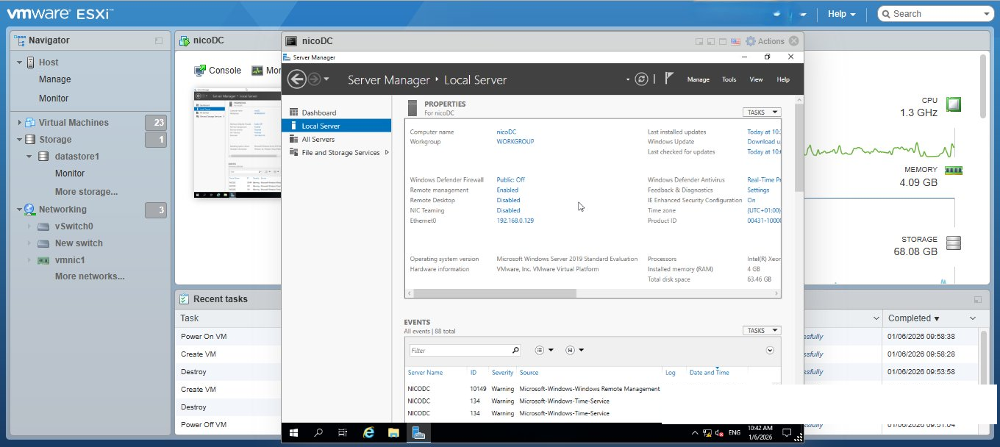

---

### 2️⃣ Install AD DS Role

Installed Active Directory Domain Services on Windows Server.

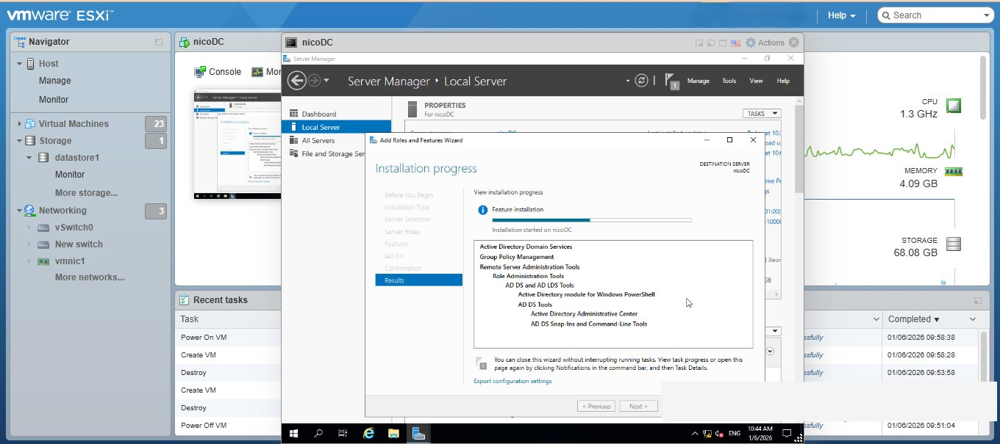

---

### 3️⃣ Promote to Domain Controller

Promoted server to Domain Controller for `nico.local`.

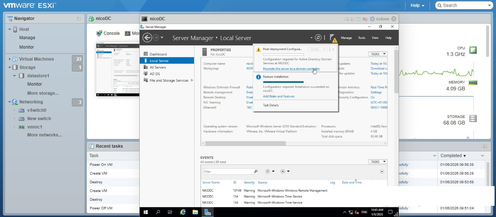

---

### 4️⃣ Domain Operational

Server successfully running as Domain Controller.

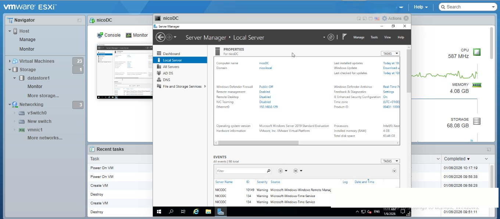

---

## 🌐 DNS Configuration

Configured Forward and Reverse Lookup Zones.

### Forward Lookup Zone

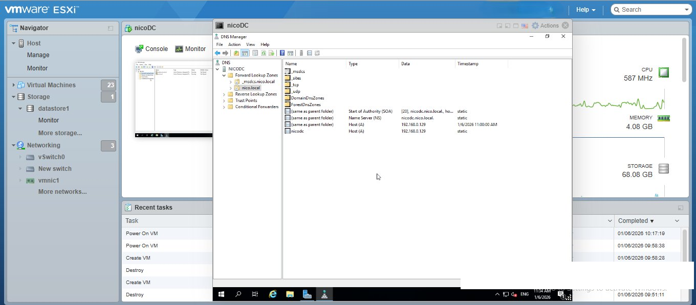

---

### Host A Records

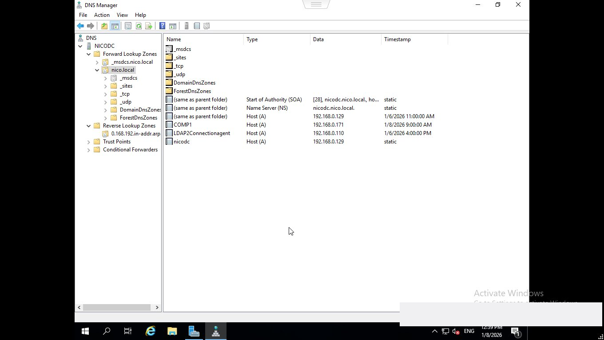

---

### Zones Running

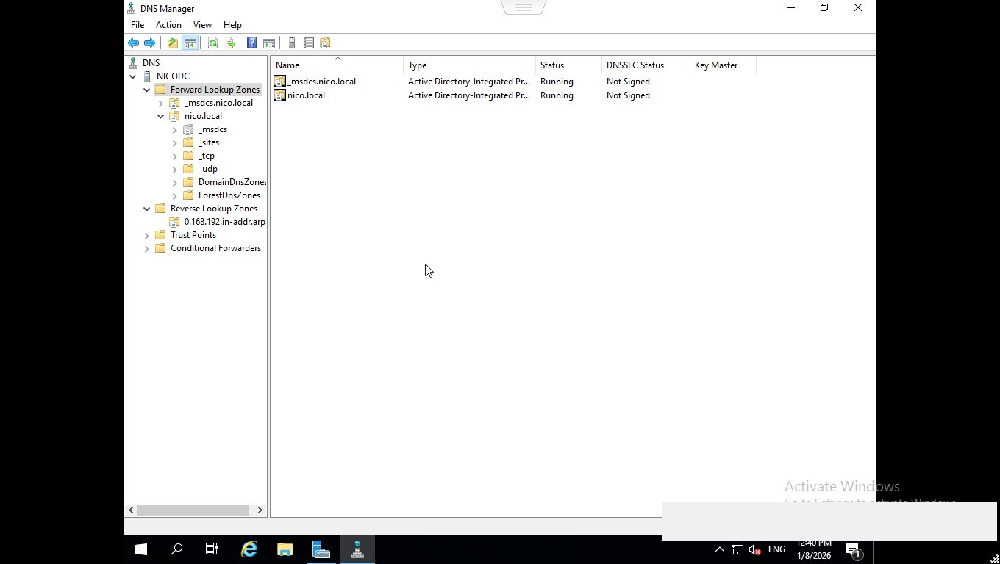

---

### Reverse Lookup Zone


---

## 💻 Client Domain Join

Windows 10 client successfully joined to the domain.

### Client Desktop

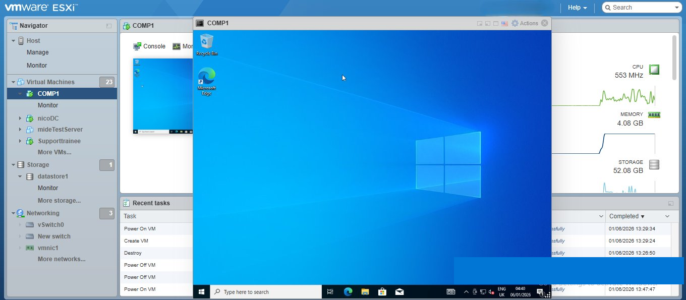

---

### Domain Join Confirmation

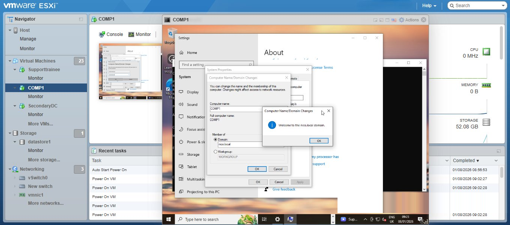

---

## 🏢 Active Directory Structure

Created department-based OU structure:

- Finance
- HR
- IT
- Sales
- Servers
- Service Accounts

### OU Structure

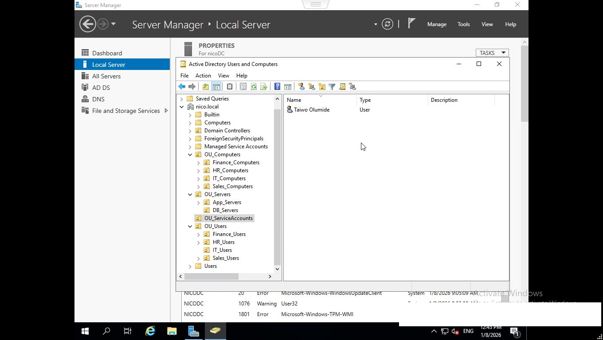

---

### Computers Container

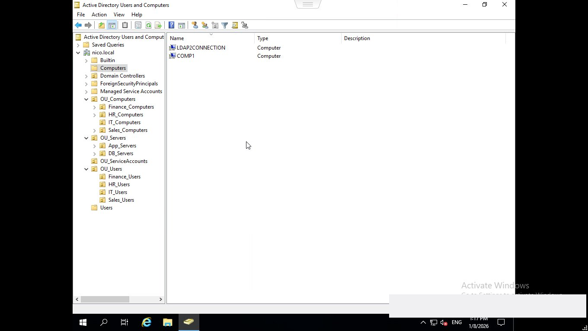

---

## 🔍 Troubleshooting Scenarios

Real issues were triggered and resolved.

### Network Troubleshooting

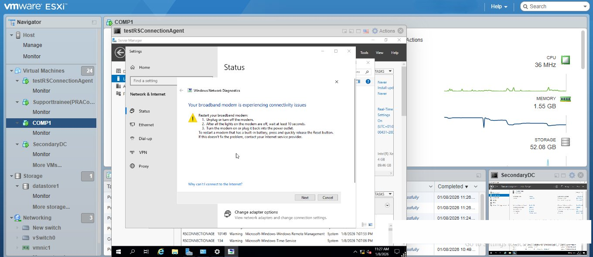

### Issues Resolved

- DNS request timed out (Firewall blocking Port 53 and ICMP)
- Secure Channel trust failure
- Broken domain join
- Ubuntu boot loop (ISO mapping issue)

---

## ✅ Validation

- Domain Controllers operational
- DNS Forward & Reverse zones running
- A and PTR records verified
- Client successfully joined to domain
- GPO applied and verified with:

```
gpresult /r
```

- Secure Channel verified with:

```
Test-ComputerSecureChannel -Verify
```

---

## 🧠 Lessons Learned

- DNS must work before anything else.
- Domain Controllers require static IPs.
- Trust relationship failures are Secure Channel issues.
- Firewall rules can silently block services.
- Thin provisioning requires monitoring.
- OU structure should be planned early.

---

## 📂 Repository Structure

```
Enterprise-IT-Infrastructure-Lab/
├── docs/
├── images/
├── scripts/
├── README.md
└── LICENSE
```

---

## 🎯 Skills Demonstrated

- Hypervisor administration (Type-1)
- Windows Server deployment
- Active Directory design
- DNS configuration and troubleshooting
- Group Policy implementation
- Domain join operations
- Secure Channel repair
- Enterprise OU structure planning
